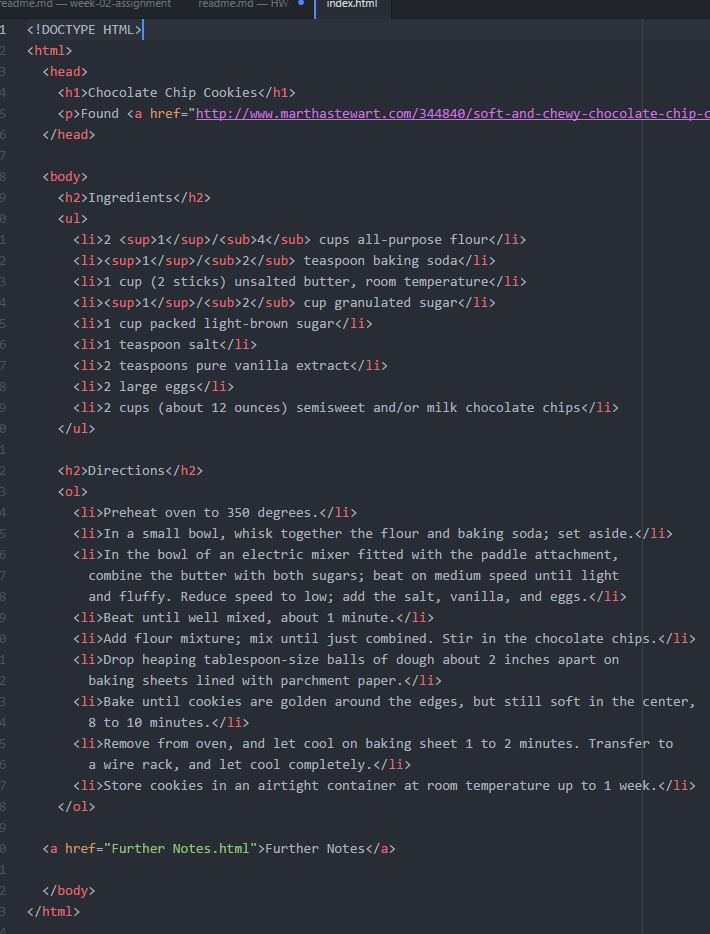
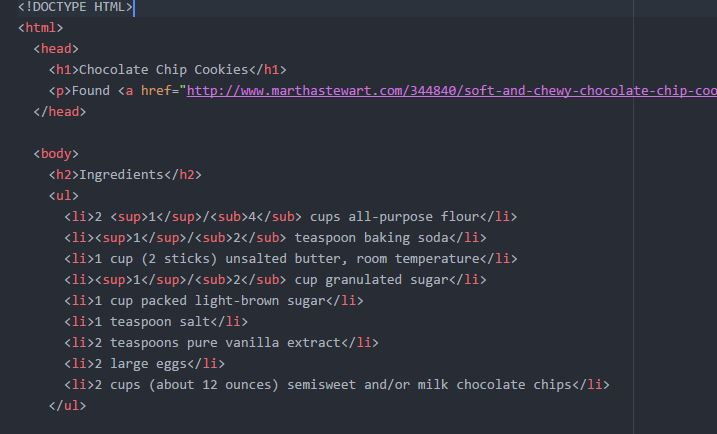
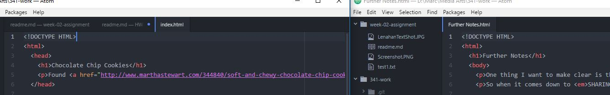
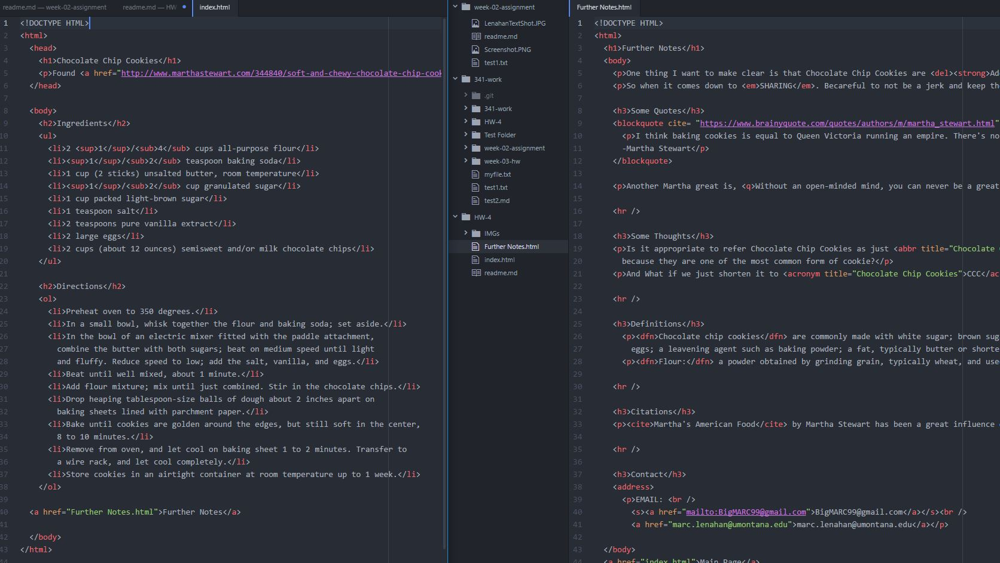
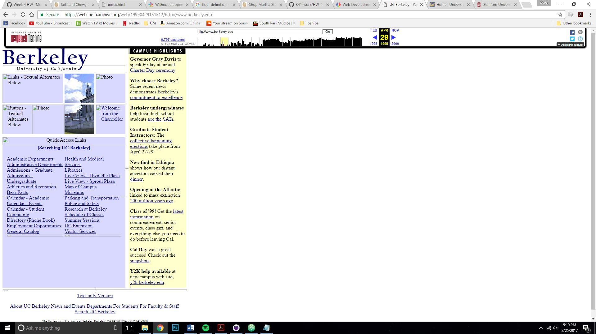
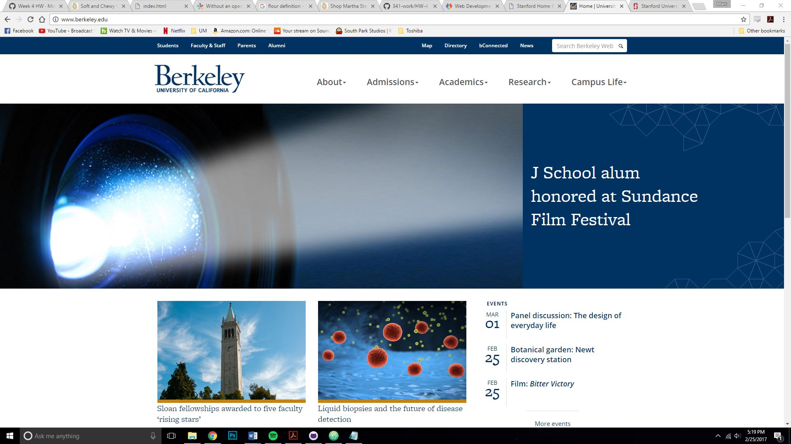
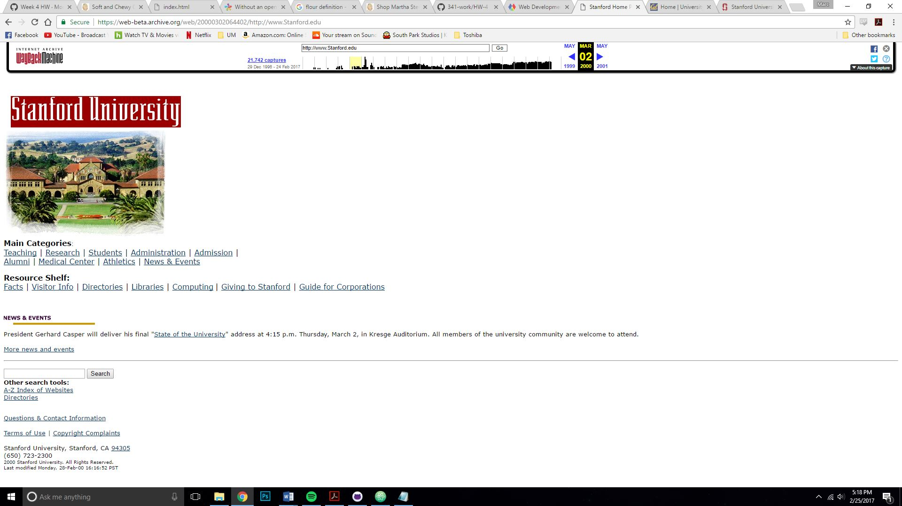
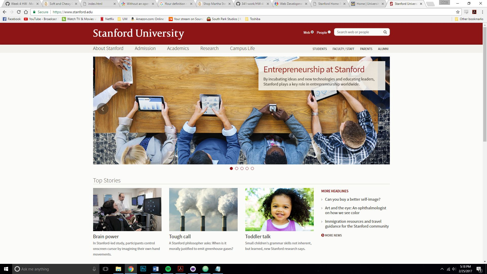

Marc Lenahan
Section 51

* For this week assignment I was to create two web pages that are linked together about a recipe. Within this assignment, I was to implement html I learned over the week which included Semantic Markup, creating links, and creating lists. To complete this assignment, I needed to use everything that was included in the lesson plan.

* The first steps I did was creating both web pages so I would have two places to go back and forth to see how things will work together. After I just filled in each page with what I thought would be appropriate to make it look like what the assignment was asking for. When it came down to the second page and using all the semantic markup I kind of made a list of all the different ones I was supposed to use then implement them one after another.
.

.

.

.

* I did not have really any issues with this one assignment. I looked at what was asked and kind of planned out the simplest way to have it done while also reaching every point that was needed.

* Some issue I found was taking a screenshot but just noticed my key was a little sticky. I passed along how to take a screen shot on some one’s issue post to clarify how to do it.

* Looking at the way back machine its interesting how webpages have evolved. Two pages I visited was UC Berkeley and the Stanford webpages. Looking at these make me truly understand how much the internet has evolved because of all the different things a webpage can produce. Back then the webpages were really just text with links and only one image. That was it and no graphics either for the most part. Very interesting especially how people navigated these sites when applying to colleges.

