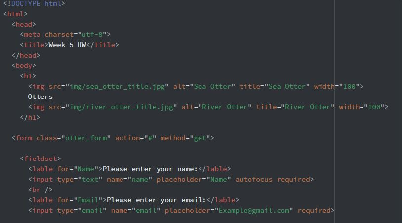
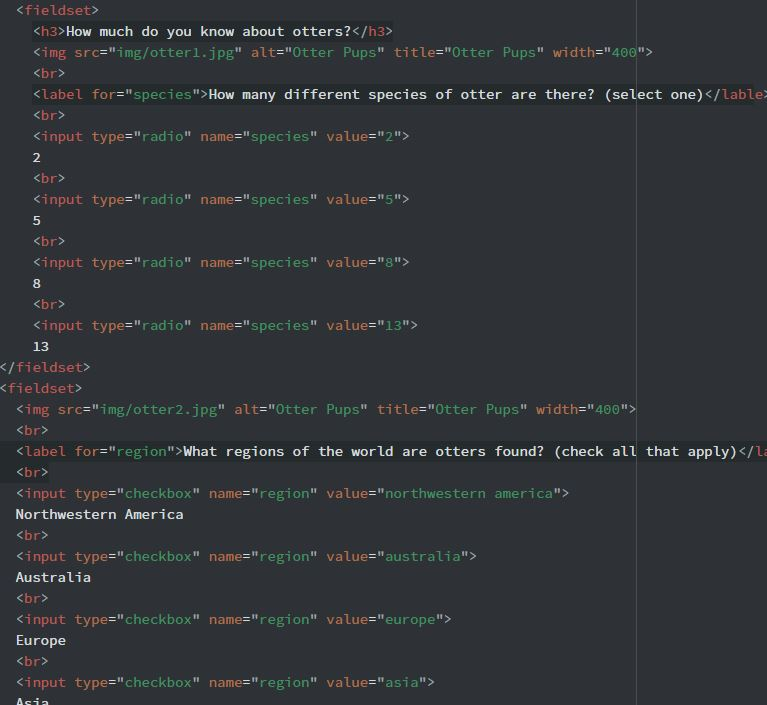

Marc Lenahan
Section 51

* For this week it is all about otters! Actually that is what my website was about. For this week I
created a webpage that implement using form elements and different attributes that associate with
interaction with a web page. There were a lot of different elements to use but I didn’t manage to
get to all of them.

* The first steps of this assignment were to come up with an outline of the layout. Unfortunately I
do not have any images of that as I sort of just had it in mind the entire time. After that it was
mainly setting up the first part which I think universally is gathering information from the user
of the web page.

Then it was mainly filling in the fluff of the assignment which included questions and how those
questions would be answered on the webpage

* At the beginning of the assignment I was having some issues with my text editor that didn’t really
cause as big of a problem as I thought but was quite annoying. I managed to put up an issue comment
on the repo and got some help about the issue. Second problem I had was adding the images to the
actual webpage as they were not showing up. That seemed to be a common problem between a few people
in which I just read and fixed it on my own. It had to do with my confusion with markup images and
the html images.

* After reading about the different elements explained in this week’s lector notes it was very
interesting learning this aspect of website development and I really enjoyed this week’s lesson.
Looking forward to what we do next.
