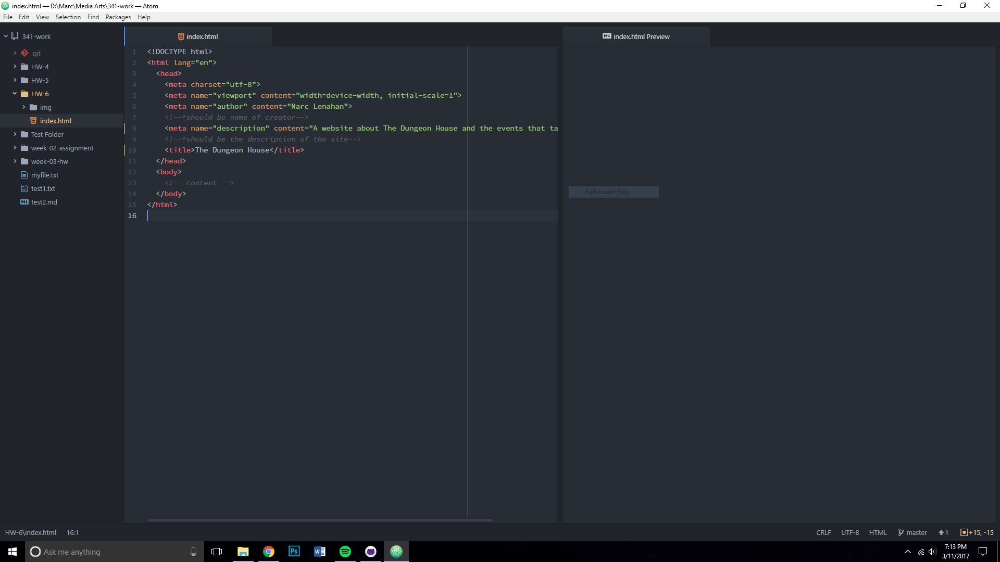
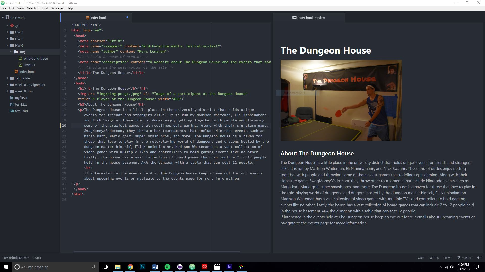
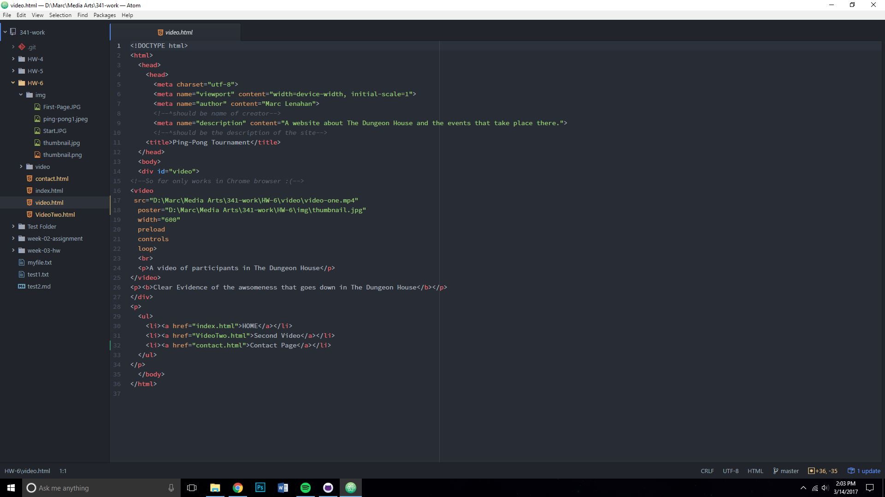
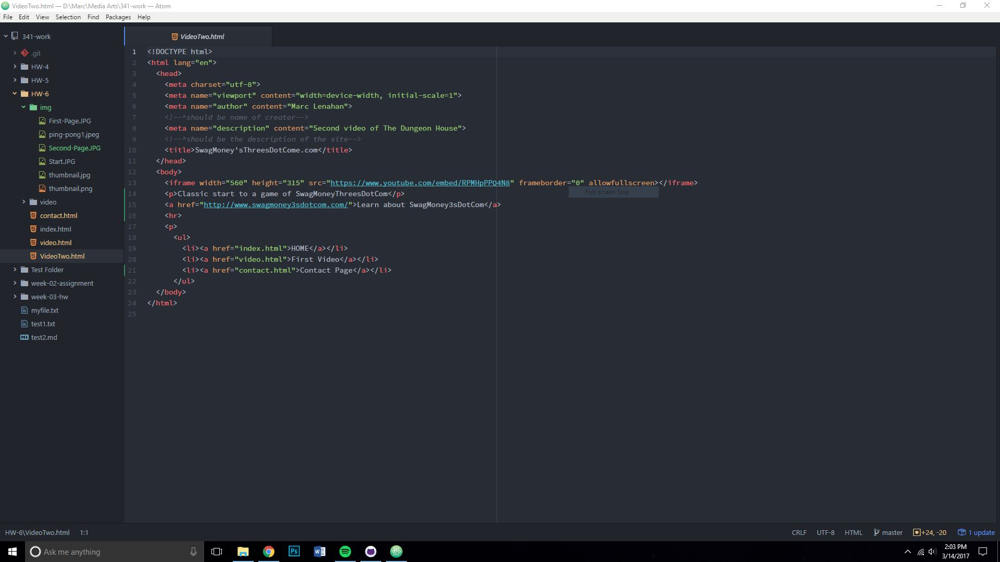
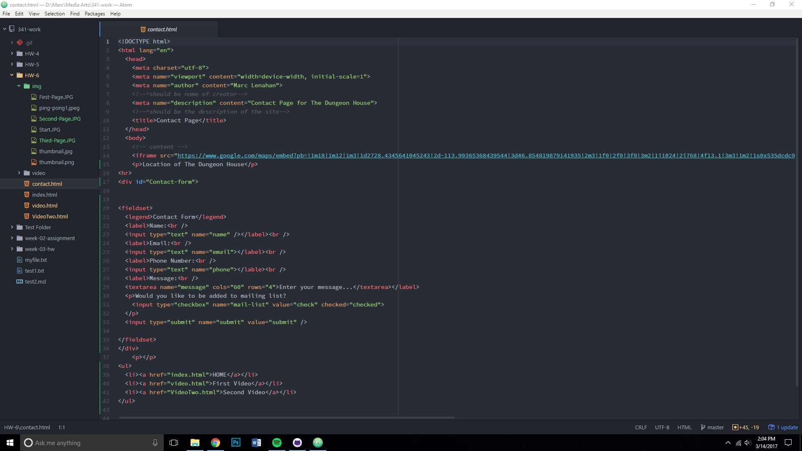

Marc Lenahan
Section 51

* For this week’s assignment, I created a website with multiple pages showing how
to further use different formats for creating a website that included embedding a
video both hosting it and adding from an outsourced site. I also used elements and
attributes discussed in recent weeks to help organize the site better.

* I first started by creating the main page that would be the home page of the entire site.

I then worked on the first video which was probably the hardest page to work on
because of the difficulty of figuring out the videos and their codecs to make sure
that they are viewable on different web browsers

The third page was simple with just adding an out sourced site, which was YouTube,
to the page.

Finally, the last page was a contact page which had google maps embedded with the
iframe element and a form for sending a message and signing up for a mailing list.

* The problems I had this week were the video conversions. We are given examples
of how to embed multiple videos yet I just couldn’t get any other to work beside
mp4. Unfortunately, I did not get anything else to work besides in chrome with the mp4

* Overall this week was kind of challenging but had great learning points that I really
want to work on for future assignments. I have a feeling that next week we will be
working with css which will help explain certain elements and attributes a little bit better.
