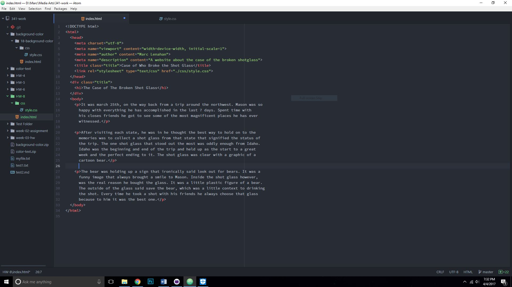
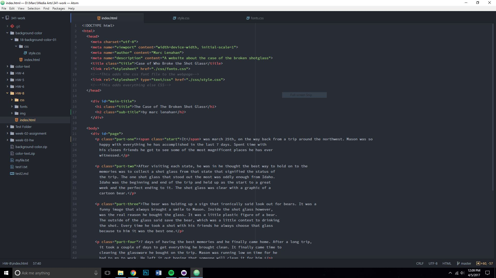
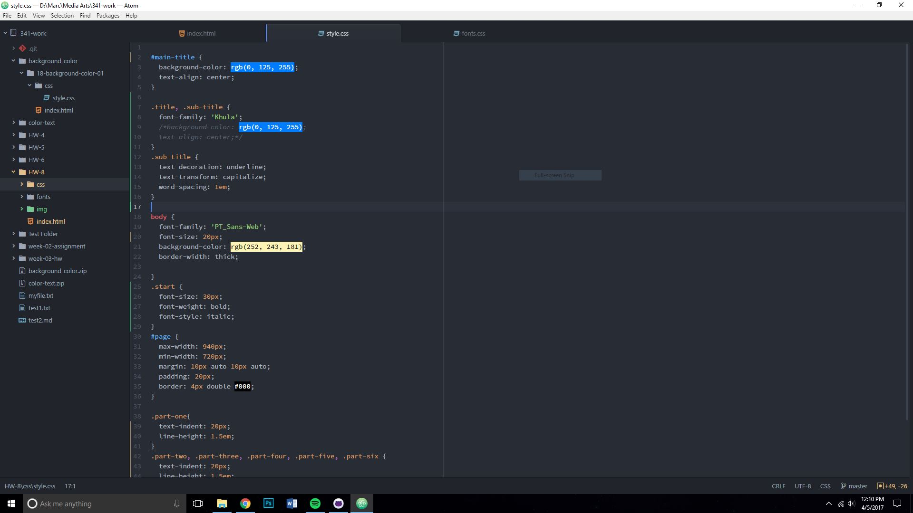
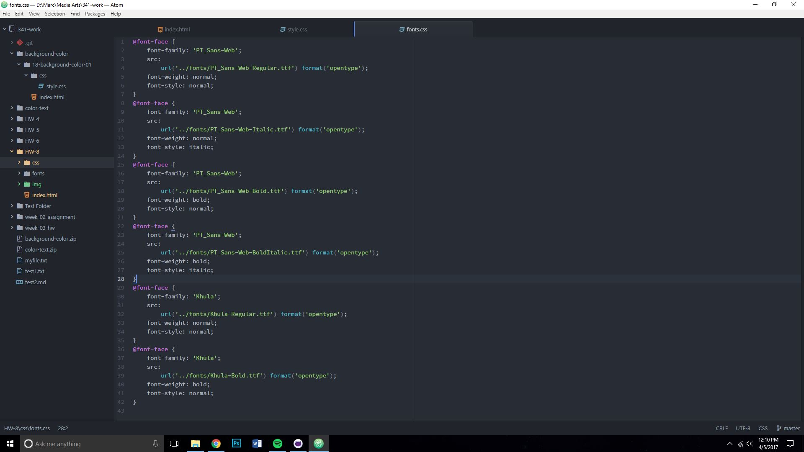

* Summary
This last homework assignment was somewhat hard at the beginning. At the start
because of the break it was a little hard getting back into things and reading
about CSS was so interesting that I got caught up with all the different things
you can change and add with it. Overall once everything was understood it got
a lot easier working on the assignment and choosing the different elements and
attributes to make the site.

* Steps
For this assignment. I started with a basic outline of what I wanted the site
to consist of.

Then I started the CSS file and went through and added what I thought was
appropriate for the site

After that I added the fonts I was going to use and created the fonts CSS file.

* Issues
I did not necessarily have problem with the content of this assignment but I was
having classic git hub issues and computer issues that ended up preventing me
from working on the assignment for a while. I ended up having to get into contact
with the support team from git hub in order to resolve the problem.

* Overall
At the end of this assignment I really enjoyed the aspect of CSS. Once again
this has fueled my interest in web dev and of course can’t wait for what we work
on next.

* Choices
For my text, I went with my choice because to me it was what I thought was pretty
normal compared to the default. I’m not a very flash person and usually go with
minimalist styles. It ended up being very clear and straight to the point.

For the colors, I thought the blue and yellow went well with each other. And didn’t
pop out too much with the black text.
