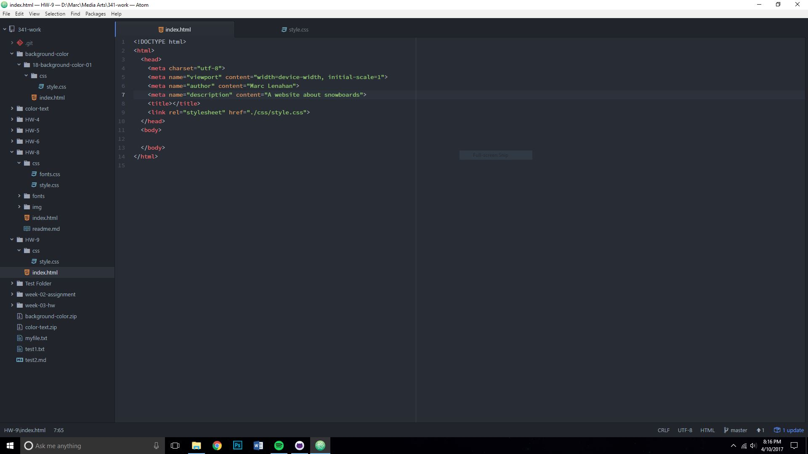
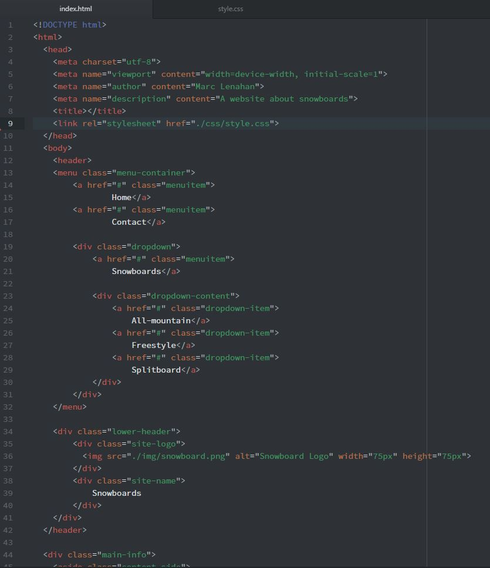
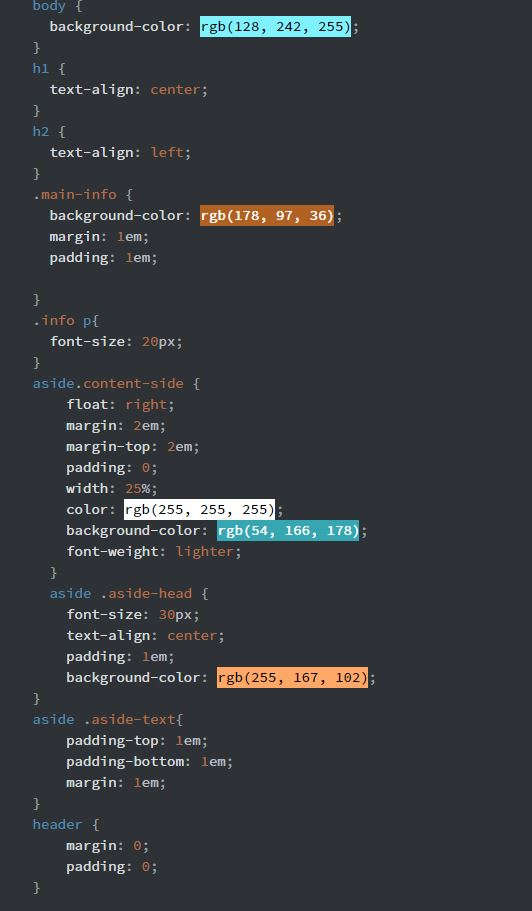

* Summary
This Homework assignment was super fun. It is another step forward to creating a
fully functioning website which is very exciting. Over the week new CSS elements
were explained which put a lot more perspective to the building of websites and
helped a lot with creating this week’s assignment.

* Steps
For the assignment I started with making the index file and the style file.

After which I got really into the work and ended up with my finished files.

* Issues
I didn’t really have much issues with this week’s assignment, just took a lot of
work and deciding what to use and what will work.

* Choices
When I came up with the color scheme I used the adobe color application and picked
out a complementary palette of browns and blues that I felt looked really nice together.
